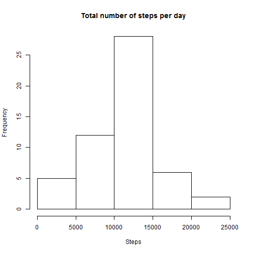
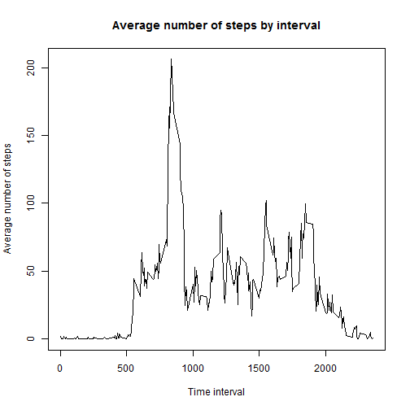
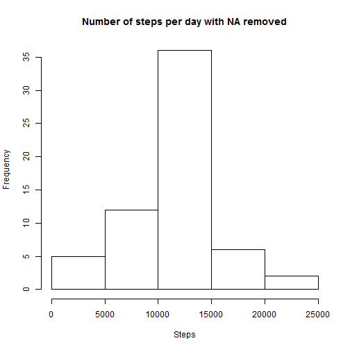
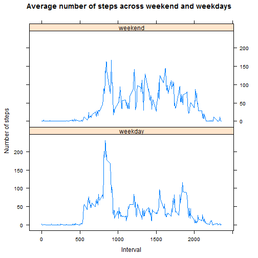

# Reproducible Research: Peer Assessment 1


## Loading and preprocessing the data
### 1. Load the data (i.e. read.csv())

```r
activity_data <- read.csv("activity.csv")
#check and summarize data
head(activity_data)
```

```
##   steps       date interval
## 1    NA 2012-10-01        0
## 2    NA 2012-10-01        5
## 3    NA 2012-10-01       10
## 4    NA 2012-10-01       15
## 5    NA 2012-10-01       20
## 6    NA 2012-10-01       25
```

```r
str(activity_data)
```

```
## 'data.frame':	17568 obs. of  3 variables:
##  $ steps   : int  NA NA NA NA NA NA NA NA NA NA ...
##  $ date    : Factor w/ 61 levels "2012-10-01","2012-10-02",..: 1 1 1 1 1 1 1 1 1 1 ...
##  $ interval: int  0 5 10 15 20 25 30 35 40 45 ...
```

```r
summary(activity_data)
```

```
##      steps                date          interval     
##  Min.   :  0.00   2012-10-01:  288   Min.   :   0.0  
##  1st Qu.:  0.00   2012-10-02:  288   1st Qu.: 588.8  
##  Median :  0.00   2012-10-03:  288   Median :1177.5  
##  Mean   : 37.38   2012-10-04:  288   Mean   :1177.5  
##  3rd Qu.: 12.00   2012-10-05:  288   3rd Qu.:1766.2  
##  Max.   :806.00   2012-10-06:  288   Max.   :2355.0  
##  NA's   :2304     (Other)   :15840
```

### 2. Process/transform the data (if necessary) into a format suitable for your analysis

```r
#change class of column date from factor to Date
activity_data$date <- as.Date(activity_data$date, format = "%Y-%m-%d")
```

<br>
<br>

## What is mean total number of steps taken per day?
### 1. Calculate the total number of steps taken per day

```r
total_steps <- aggregate(steps ~ date, activity_data, sum, na.rm = FALSE)
#check data
head(total_steps)
```

```
##         date steps
## 1 2012-10-02   126
## 2 2012-10-03 11352
## 3 2012-10-04 12116
## 4 2012-10-05 13294
## 5 2012-10-06 15420
## 6 2012-10-07 11015
```

### 2. Make a histogram of the total number of steps taken each day

```r
hist(total_steps$steps,main = paste("Total number of steps per day"), xlab = "Steps", ylab = "Frequency")
```

 

### 3. Calculate and report the mean and median of the total number of steps taken per day

```r
mean(total_steps$steps)
```

```
## [1] 10766.19
```

```r
median(total_steps$steps)
```

```
## [1] 10765
```

<br>
<br>


## What is the average daily activity pattern?
### 1. Make a time series plot (i.e. type = "l") of the 5-minute interval (x-axis) and the average number of steps taken, averaged across all days (y-axis)

```r
avg_interval <- aggregate(steps ~ interval, activity_data, mean, na.rm = TRUE)
plot(avg_interval$interval, avg_interval$steps, type = "l", main = "Average number of steps by interval", xlab = "Time interval", ylab = "Average number of steps")
```

 

### 2. Which 5-minute interval, on average across all the days in the dataset, contains the maximum number of steps?

```r
max_steps <- avg_interval$interval[which.max(avg_interval$steps)] #5-minute interval
num_of_steps <- avg_interval[max_steps,] #number of steps for the interval
```
The *835*th interval contains the maximum number of steps on average across all days, with *206.1698* steps

<br>
<br>

## Imputing missing values
### 1. Calculate and report the total number of missing values in the dataset (i.e. the total number of rows with NAs)

```r
sum(is.na(activity_data))
```

```
## [1] 2304
```

### 2. Devise a strategy for filling in all of the missing values in the dataset. The strategy does not need to be sophisticated. For example, you could use the mean/median for that day, or the mean for that 5-minute interval, etc.

### 3. Create a new dataset that is equal to the original dataset but with the missing data filled in.

**Substitution of NA values with the mean for the particular 5-minute interval**


```r
new_dataset <- activity_data #create a copy of the original dataset
for(i in 1:nrow(new_dataset)){
  if(is.na(new_dataset$steps[i])){
    #set specific interval
    interval_value <- new_dataset$interval[i]
    #get mean for specific interval
    new_step_value <- avg_interval[avg_interval$interval == interval_value, ] 
    #assign the mean for interval to NA value
    new_dataset$steps[i] <- new_step_value$steps 
  }
}
```

```r
#check for NAs
sum(is.na(new_dataset$steps))
```

```
## [1] 0
```

```r
#check data
head(new_dataset)
```

```
##       steps       date interval
## 1 1.7169811 2012-10-01        0
## 2 0.3396226 2012-10-01        5
## 3 0.1320755 2012-10-01       10
## 4 0.1509434 2012-10-01       15
## 5 0.0754717 2012-10-01       20
## 6 2.0943396 2012-10-01       25
```

### 4. Make a histogram of the total number of steps taken each day and Calculate and report the mean and median total number of steps taken per day. Do these values differ from the estimates from the first part of the assignment? What is the impact of imputing missing data on the estimates of the total daily number of steps?

```r
#get total number of steps when NA removed
new_total_steps <- aggregate(steps ~ date, new_dataset, sum)
#create new histogram
hist(new_total_steps$steps, main = "Number of steps per day with NA removed", xlab = "Steps", ylab = "Frequency")
```

 

```r
#get new mean
mean(new_total_steps$steps)
```

```
## [1] 10766.19
```

```r
#get new median
median(new_total_steps$steps)
```

```
## [1] 10766.19
```
**Imputing missing data does not cause any change on mean and median values**

<br>
<br>

## Are there differences in activity patterns between weekdays and weekends?
### 1. Create a new factor variable in the dataset with two levels - "weekday" and "weekend" indicating whether a given date is a weekday or weekend day.


```r
new_dataset$day <- NA
day <- weekdays(as.Date(new_dataset$date, format = "%Y-%m-%d")) #create vector with weekdays based on new_dataset$date
for (i in 1:nrow(new_dataset)){   #create new column according to day vector
  if (day[i] == "Saturday" | day[i] == "Sunday"){ 
    new_dataset$day[i] <- "weekend"
  } else {
    new_dataset$day[i] <- "weekday"
  }
}
str(new_dataset)
```

```
## 'data.frame':	17568 obs. of  4 variables:
##  $ steps   : num  1.717 0.3396 0.1321 0.1509 0.0755 ...
##  $ date    : Date, format: "2012-10-01" "2012-10-01" ...
##  $ interval: int  0 5 10 15 20 25 30 35 40 45 ...
##  $ day     : chr  "weekday" "weekday" "weekday" "weekday" ...
```

### 2. Make a panel plot containing a time series plot (i.e. type = "l") of the 5-minute interval (x-axis) and the average number of steps taken, averaged across all weekday days or weekend days (y-axis). See the README file in the GitHub repository to see an example of what this plot should look like using simulated data.


```r
avg_step_int_day <- aggregate(steps ~ interval + day, data = new_dataset, mean)
library(lattice)
xyplot(steps ~ interval | day, data = avg_step_int_day, type = "l", lwd = 1, layout = c(1,2), main = "Average number of steps across weekend and weekdays", xlab = "Interval", ylab = "Number of steps")
```

 

<br>
<br>
